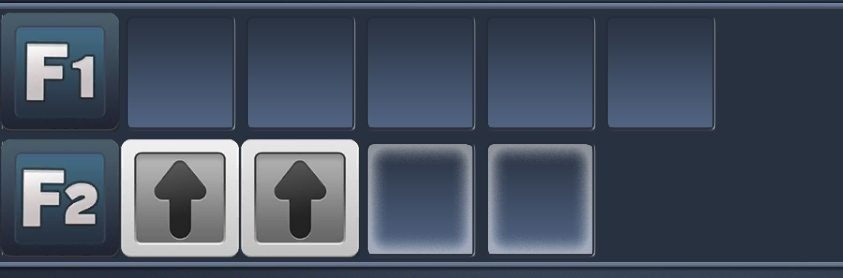
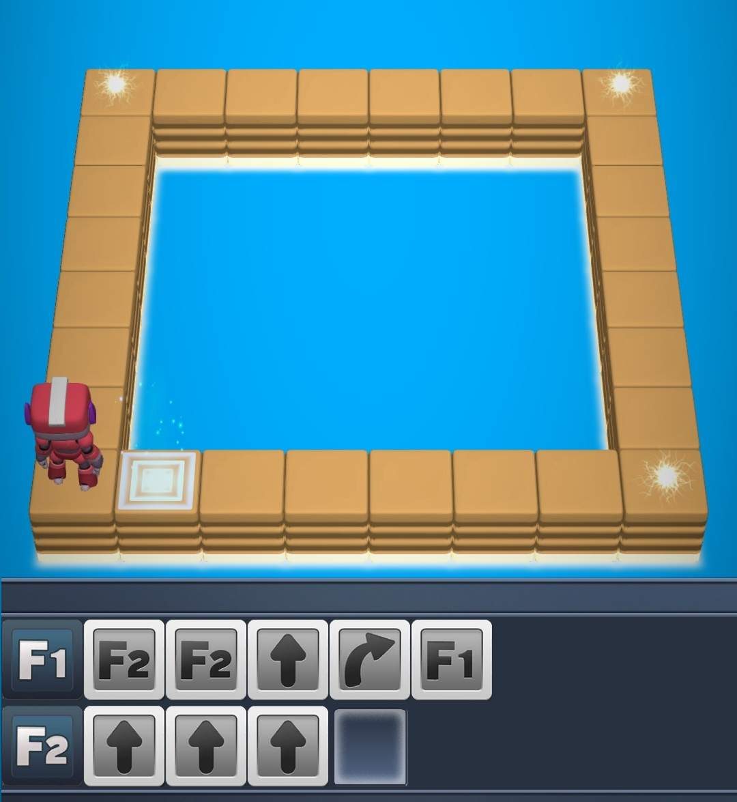

Lisää funktioiden treenausta. Pelin kaksi ensimmäistä osaa (*Basics* ja *Functions*) ovat ohjeistettuna ekaluokkalaistenkin läpäistävissä.  Pelin kolmannen osan (*Recursion*) viimeiset kentät ovat hyvin vaikeita ja vaativat enemmän hahmottamis- kuin koodauskykyjä eli ei kannata olettaa että oppilaat pääsisivät niitä läpi. Tekemistä pitäisi silti riittää tunniksi ennen tehtävien muuttumista liian vaikeiksi.

Youtubesta löytyy [esimerkkiratkaisut rekursio-osion tehtäviin](https://www.youtube.com/watch?v=So8DZuzY2JA&ab_channel=asclimcatch).

**Huom**: Peli toimii vain mobiililaitteilla, jos sellaisia ei ole käytössä niin suosittelen pelaamaan **Rodocodo**-pelin **Part 2**-osion, jossa harjoitellaan funktioita.

> ### Tietosuoja
> Kirjoitushetkellä (18.10.2023) pelin datankeruusta mainitaan mobiilialustoilla:
> - **App Store**: Data Not Collected: The developer does not collect any data from this app.
> - **Play Store**: No data collected. No data shared with third parties.

<!--
NOTES: Rekursio-osiossa on mahdotonta selittää käytännön esimerkeillä rekursin ja infinite loopin eroa, sillä pelissä ei ole lopetusehtoja rekursiolle.
-->

<!--  -->

---

# Aliohjelmat eli funktiot

***F1**-rivi on `pääohjelma` eli sen sisään laitetut käskyt suoritetaan aina automaattisesti kun koodi suoritetaan (robotti liikkuu kaksi ruutua eteenpäin)*

***F2**-rivi on `aliohjelma` eli sen sisään laitettuja käskyjä ei suoriteta automaattisesti (kuvan koodi ei tee mitään)*

***F2**-rivin käskyt suoritetaan ainoastaan kun käytetään **F2**-käskyä (kuvan koodi liikuttaa robottia kahdesti eteenpäin)*

*Pääohjelmassa on kaksi **F2**-käskyä eli **F2**-rivillä olevat käskyt suoritetaan kahdesti (robotti liikkuu neljä ruutua eteenpäin)*

*Esimerkkikoodissa robotti liikkuu kaksi ruutua eteepäin, kääntyy oikealle ja liikkuu taas kaksi ruutua eteenpäin*

*Functions-maailman 1. tehtävä*

<!--  -->

*Jos opettajalla on kiire usean oppilaan auttamisessa, joskus on nopeinta koodata aliohjelmat oppilaan puolesta ja palata myöhemmin katsomaan onko oppilas saanut kentän läpäistyä aliohjelmia käyttäen. Miten **F1**- ja **F2**-aliohjelmia pitäisi käyttää kentän läpäisemiseksi?*

# Rekursio-osion ratkaisut

*Jos **F1**-rivin lopussa on **F1**-käsky, suoritetaan **F1**-rivin käskyjä ikuisesti uudestaan. Tällaista kursutaan **ikuiseksi silmukaksi** *(infinite loop)*. Kuvan robotti liikkuu ikuisesti eteenpäin.*

*Robotti mutkittelee eteenpäin yksi "porras" kerrallaan rekursion avulla.*

<!---->

*Mitenköhän `F1` ja `F2`-käskyjä pitäisi käyttää kentän läpäisemiseksi?*

*<u>Rekursio-osan 9. kenttä</u> on jo hyvin kryptinen eikä kukaan oppilaistani ole läpäissyt tätä itsenäisesti.*

*Kryptisyys jatkuu...*
