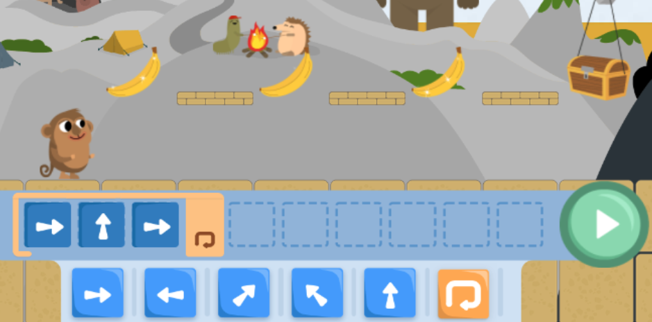

**CodeMonkey Jr** toimii hyvänä ensikosketuksena ohjelmointiin ja on täysin symbolinen eli lukutaitoa ei vaadita.

Omalla kokemuksellani kahden ensimmäisen tehtävän läpikäynti luokan edessä riittää, tämän jälkeen oppilaat pärjäävät melko hyvin omillaan; opettaja voi keskittyä opettajajohtoisen opettamisen sijasta oppilaiden henkilökohtaiseen opastamiseen (ihan  kuten matematiikan tunneilla, kysymyksillä johdattamalla)

> ### Kysymyksillä johdattaminen
> *"Minne apinahahmon pitäisi mennä?"* \
> => *Pitäisikö apinan mennä vasemmalle vai oikealle?*\
> => *"Montako ruutua apinan pitäisi liikkua kyseiseen suuntaan?*\
> => *"Mikä käsky pitäisi laittaa ensimmäiseksi (entä montako sellaista pitäisi laittaa että apina pääsisi perille?"*).

Opettajan kannattaa korostaa <u>ettei kaikkia käskyjä kannata aina edes yrittää laittaa kerralla</u>, vaan niitä voi lisätä yksi tai kaksi kerrallaan, välillä testaten että käskysarja toimii toivotusti. Näin on helpompi tunnistaa missä kohtaa koodi menee pieleen ja korjata se.

> Pelatessa voi havainnoida että <u>tietokoneohjelmat koostuvat peräkkäisistä käskyistä</u> eli `käskysarjoista`. Käskyjen järjestyksellä on merkitystä eikä niitä voi sijoittaa miten sattuu; käskyt suoritetaan järjestyksessä ensimmäisestä viimeiseen, tässä tapauksessa vasemmalta oikealle.

**Code Monkey Jr** (kuten useimmat muut graafiset ohjelmointiympäristöt) korostaa kirkkaimpana parhaillaan suoritettavan käskypalikan. Tämän takia on helppoa havainnoida missä kohtaa koodin suoritusta ollaan. Tämä on hyödyllistä esimerkiksi silloin kun halutaan selvittää missä kohtaa koodia asiat menevät pieleen.

---

Pelin viimeinen puolisko sisältää yksinkertaisten käskysarjojen lisäksi myös `toista-ikuisesti` -silmukan käyttöä. Ei kuitenkaan haittaa vaikka oppilaat eivät ehtisi näihin tehtäviin saakka, sillä silmukan konseptin opettelun voi jättää tuleville tunneille. Jos oppilaat ehtivät silmukoihin saakka, voi opettaja selittää että ikuisesti-silmukan sisään voi raahata yhden tai useamman käskyn joita toistetaan ikuisesti.

> **Koodi**: IKUISESTI: oikealle\
> **suoritetaan näin:** oikealle, oikealle, oikealle, oikealle...
>
> **Koodi**: IKUISESTI: oikealle, vasemmalle\
> **suoritetaan näin:** oikealle, vasemmalle, oikealle, vasemmalle...

*Silmukan sisälle voi raahata useamman käskynpalikan*

---

Jos oppilaat saavat kaikki tehtävät tehtyä tunnin aikana, pyydä heitä tarkistamaan saivatko he kaikista tehtävistä kolme tähteä (eli läpäisivät tehtävät pienimmällä mahdollisella käskymäärällä). Toki seuraaviinkiin tehtäviin voi jo päästää.

Jos oppilailla on käytössä kosketusnäytöttömät tietokoneet, <u>on CodeMonkey hyvä ympäristö hiiren käytön harjoitteluun</u>, sillä käskyt lisätään ohjelmaan klikkaamalla haluttua käskypalikkaa (toisin kuin esim. Code.org:in harjoituksissa joissa käskypalikat pitää osata raahata paikoilleen) - toki käskyjä voi halutessaan uudelleenjärjestää myös raahaamalla.

Jos pidätte iltapäiväkerhoa koulun ulkopuolella, älkää olettako että oppilaat osaisivat käyttää hiirtä - kouluista suuri osa käyttää vain iPadeja tai kosketusnäytöllisiä Chromebookeja. Näppäimistön ja kymmensormijärjestelmän käyttöä onneksi harjoitellaan useimmissa kouluissa esim. Näppistaiturin avulla.

**Huom:** Suosittelen laittamaan selaimen fullscreen-tilaan, jotta pelille jää enemmän pinta-alaa näytöllä. Chromen oikeasta yläkuolmasta löytyy kolme pistettä, joita painamalla avautuu valikko josta löytyy fullscreen-ikoni.
