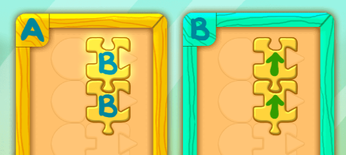

<!--
- title: iPad/iPhone (maksullinen)
  url:   https://apps.apple.com/us/app.-start/id1090682359
-->

Pelin nettiversion toimii iPadeilla ja Chromebookeilla, joten suosittelen käyttämään sitä (testatkaa toki nettiversion toimivuus laitteillanne ennen tunnin alkua). Tähän mennessä olemme opetelleet pääasiassa `toista`-silmukan käyttöä. Tässä pelissä opettelemme uuden konseption eli `funktion`.

<u>Käytämme sanoja funktio ja aliohjelma toistensa synonyymeinä.</u>

---

## Aliohjelmat eli funktiot

*A-laatikko on `pääohjelma` eli sen sisään laitetut käskyt suoritetaan aina automaattisesti kun koodi suoritetaan (robotti liikkuu kaksi ruutua eteenpäin)*

*B-laatikko on `aliohjelma` eli sen sisään laitettuja käskyjä ei suoriteta automaattisesti (kuvan koodi ei tee mitään)*

*B-laatikon käskyt suoritetaan ainoastaan kun käytetään B-käskyä (kuvan koodi liikuttaa robottia kahdesti eteenpäin)*

*Esimerkkikoodissa on kaksi B-käskyä eli B-laatikon sisällä olevat käskyt suoritetaan kahdesti (robotti liikkuu neljä ruutua eteenpäin)*

*Esimerkkikoodissa robotti liikkuu kaksi ruutua eteepäin, kääntyy oikealle ja liikkuu taas kaksi ruutua eteenpäin*

***Tehtävä 6:** Kentässä käytetään kahdesti B-aliohjelmaa (eli funktiota)*

***Tehtävän 8:** esimerkkiratkaisu*

## Rekursio

*Jos A-laatikon viimeinen käsky on A-käsky, suoritetaan A-laatikon käskyjä ikuisesti uudestaan. Tällaista kutsutaan **ikuiseksi silmukaksi** *(infinite loop)*.*

*Koska A-laatikon viimeinen käsky on A-käsky, suoritetaan A-laatikon käskyjä ikuisesti uudestaan (robotti liikkuu ikuisesti eteenpäin)*.

*B-laatikon viimeinen käsky on B-käsky, joten B-laatikon käskyjä toistetaan ikuisesti. Myös A-laatikossa on oltava B-käsky, jotte B-laatikon **ikuinen silmukka** *("infinite loop")* käynnistyy*.

***Tehtävä 17**: Kentässä opitaan uusi käsite eli `jos-lause`, jota on tarkoitus opetella vasta tulevilla tunneilla. Jos joku oppilaista sattuisi tänne saakka pääsemään, voi selittää että nuoli tarkoittaa <u>"JOS eteenpäin ei voi liikkua"</u>. Ylläoleva koodi tarkoittaa siis:    1) Mene eteenpäin   2) JOS eteenpäin ei voi liikkua NIIN käänny vasemmalle   3) Suorita A-käsky uudestaan    (robotti kulkee ikuisesti eteenpäin, kääntyen vasemmalle aina kun seinä tulee vastaan)*

<!--
> **Funktion määritelmä**
>
> Tässä pelissä laatikot ovat aliohjelman (eli funktion) määritelmiä. Niiden sisälle laitetut määrittämät mitä tapahtuu kun esim. A-käskyä käytetään.
>
> A-laatikko on `funktion määritelmä` (laatikon sisälle laitettavilla käskyillä määritellään mitä funktion halutaan tekevän).
>
> A-käsky  on `funktiokutsu`. Se suorittaa kaikki `funktiomääritelmän` sisällä olevat käskyt
-->

<!--
- Funktiot
- Rekursio
- Rekursiosilmukka
- "Ruvetaanpas koodaamaan" => "Oho meiltä loppuu tila" => "Tehdään tilaa siirtämällä käskyt B-laatikkoon" => *Oho mitään ei tapahdu kun suoritetaan peli* => "Ainoastaan A-laatikon koodi suoritetaan automaattisesti, jotta B-laatikon koodi suoritetaan meidän on käytettävä B-käskyä"

- Web-versio toimii mobiililaitteillakin, iOS-versio on maksullinen
- Pelatkaa niin paljon mitä yhdellä tunnilla ehditte
-->
