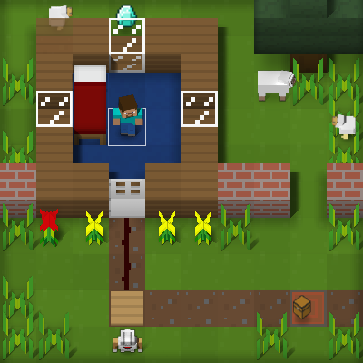
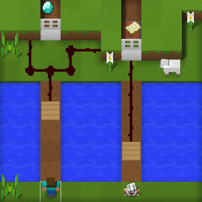
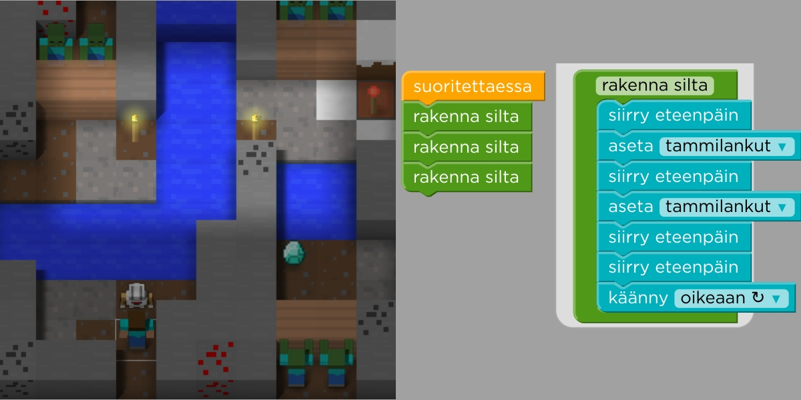
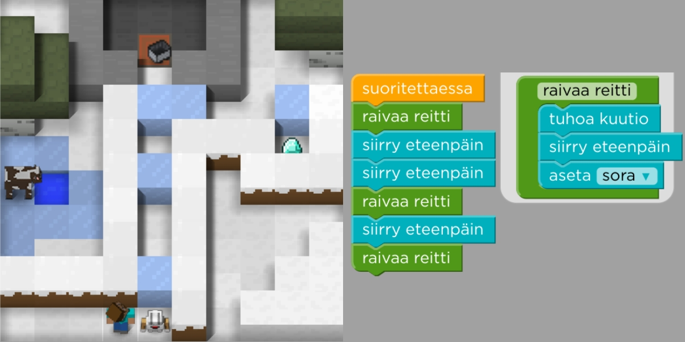
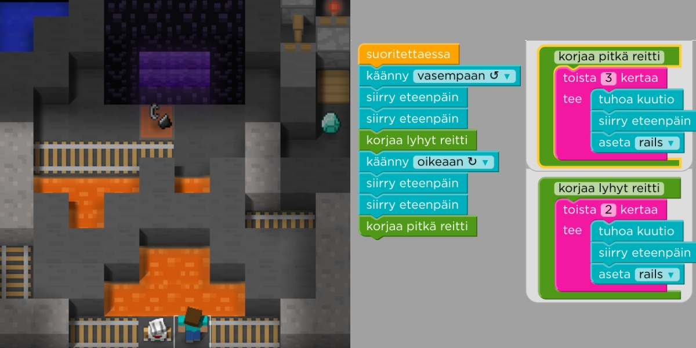

Peli poikkeaa edellisistä Minecraft-harjoituksista siten, että pelihahmoa liikutetaan nuolinäppäimillä (tai klikkaamalla) ja robottia ohjataan koodaamalla. Robotti osaa leijua veden päällä eli sitä voi käyttää esimerkiksi siltojen rakentamiseen veden yli.

***Tehtävä 1**: Robottia on liikutettava ruutu eteenpäin, jotta se astuu painelaatalle, joka on johdotettu avaamaan oven.*

***Tehtävä 2**: Jos pelaaja haluaa kerätä molempien ovien takana olevat esineet, on robotti koodattava liikkumaan vasemmalle painelaatalle (sillä laatasta menee johdotus molemmille oville)*

***Kenttä 8**: <u>rakenna silta</u>-käsky suorittaa kaikki <u>rakenna silta</u>-lohkon sisällä olevat käskyt (joista viimeinen on "käänny oikealle")*

***Tehtävä 9**: <u>Raivaa reitti</u>-aliohjelma (eli funktio) tuhoaa jäälohkareen, siirtyy eteenpäin tuhotun jäälohkareen kohdalle ja asettaa alta paljastuneeseen vesikuoppaan sorakuution. Robotti on siis siirrettävä aina jäälohkareen eteen ja käytettävä <u>Raivaa reitti</u>-käskyä*

***Tehtävä 10**: <u>korjaa pitkä reitti</u>-aliohjelma (eli funktio) tuhoaa kolmen sorakuution suoran, <u>korjaa lyhyt reitti</u>-käsky tuhoaa kahden sorakuution suoran. Robotti on siis aina liikutettava sorakasan eteen ja käytettävä oikeaa käskyä.*
