**Huom:** Käskypalikoiden raahaaminen ei toimi jostain syystä nettiversiossa kosketusnäytöllä. Käyttäkää nettiversiota ainoastaan hiiren kanssa tai ladatkaa mobiiliversio.

> ### Tietosuoja
> Kirjoitushetkellä (18.10.2023) pelin datankeruusta mainitaan mobiilialustoilla:
> - **App Store**: Data Not Collected: The developer does not collect any data from this app.
> - **Play Store**: No data collected. No data shared with third parties.

---

*Pelin alussa pelaajan on valittava kummasta vaikeustasosta haluaa aloittaa. Suosittelen aloittamaan **Part 1**:llä (jonka loppupään tehtävissä on kyllä haastetta isommillekin). Nopeimmat saavat sen luultavimmin tehtyä ja voivat siirtyä **Part 2**:n tehtäviin. Jos kaikki aloittavat Part 2:sta, riskinä on että harjoitukset ovat osalle liian vaikeita ja nopeimmat saavat tehtyä ne hetkessä ja heille pitää keksiä lisätehtäviä.*

**Huom:** Pelin Part 2 -osiossa harjoitellaan myös funktioiden käyttöä. Harjoittelemme funktioiden käyttöä enemmän tulevissa harjoituksissa, joten ei haittaa jos/kun suurin osa oppilaista ei niihin saakka todennäköisimmin ehdi. Kannattaa varautua kuitenkin selittämään funktioiden konsepti nopeimmille oppilaille lukemalla tämän ohjeistuksen alaotsikko **Part 2: Funktiot**.

**Huom:** Suosittelen koittamaan peliä ennen esimerkkiratkaisuiden lukemista, sillä käytännön oppiminen on parasta oppimista.

# Part 1:n esimerkkiratkaisuja
Robocodo on sivuston listaamista koodauspeleistä haastavimpia hahmottaa, joten olen listannut tänne esimerkkiratkaisut vaikeimpiin tehtäviin:

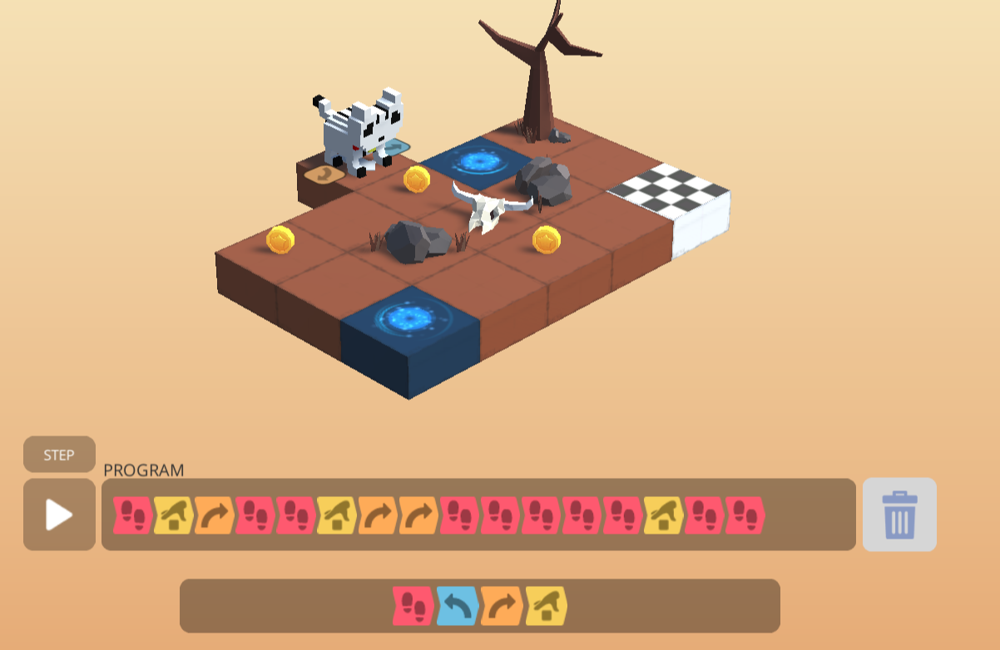
*Tähän kenttään jää jumiin suurin osa oppilaista. Tärkeintä on tajuta, että ensin on kerättävä kaksi lähintä kolikkoa ja sitten palattava puun viereiselle teleportille, ei alanurkassa olevalle.*

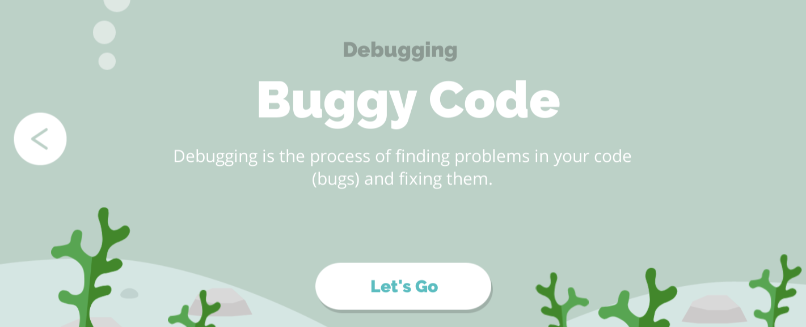
***Buggy code** (buginen koodi) -osuudessa oppilaalle annetaan valmiiksi tehtyä, virheellistä koodia, joka hänen on korjattava järjestelemällä käskyt oikein. Tämä on jonkin verran haastava osuus sillä oppilas voi vahingossa raahata tarvittavan käskyn pois koodialueelta, jolloin se tuhoutuu ja <u>kenttä on aloitettava alusta (painamalla roskiskuvaketta koodin oikealla puolella). Oppilas ei välttämättä tajua tätä.</u>*

## Part 1: Silmukat

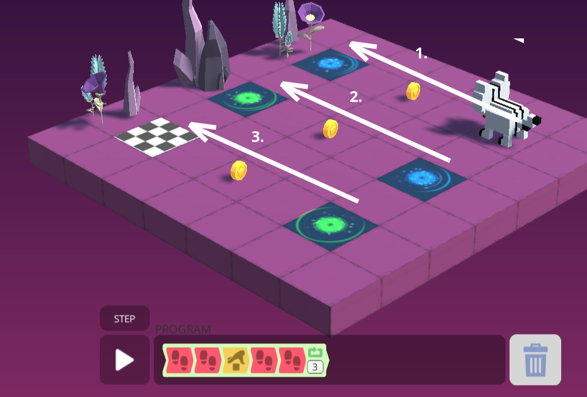
*Silmukkatehtävissä on tärkeää hahmottaa kentän toistuva osuus. Tässä kentässä pitää kolmesti kävellä ylös teleportilla (ja napata kolikko matkalla)*

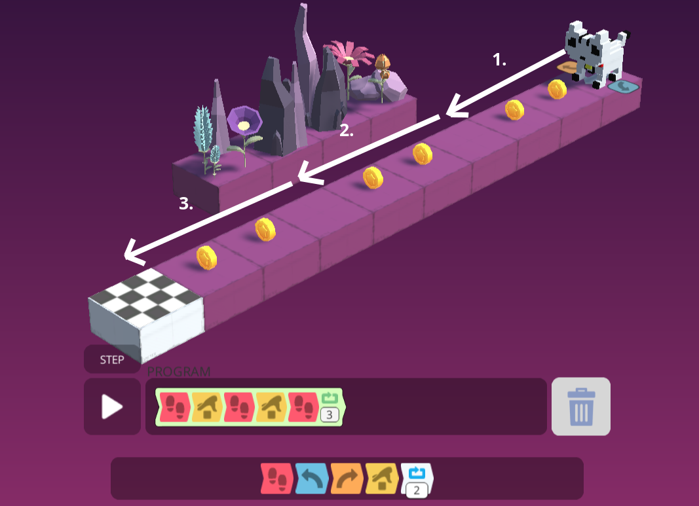
*Tässä tehtävässä on kolme kahden kolikon rypästä eli koodin on toistettava kolmesti käyttäen `toista`-silmukkaa.*

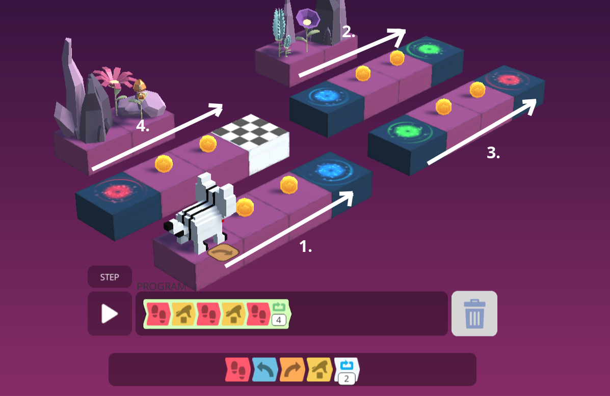
*Tässä tehtävässä on neljä identtistä saareketta, joten on käytettävä `toista` silmukkaa*

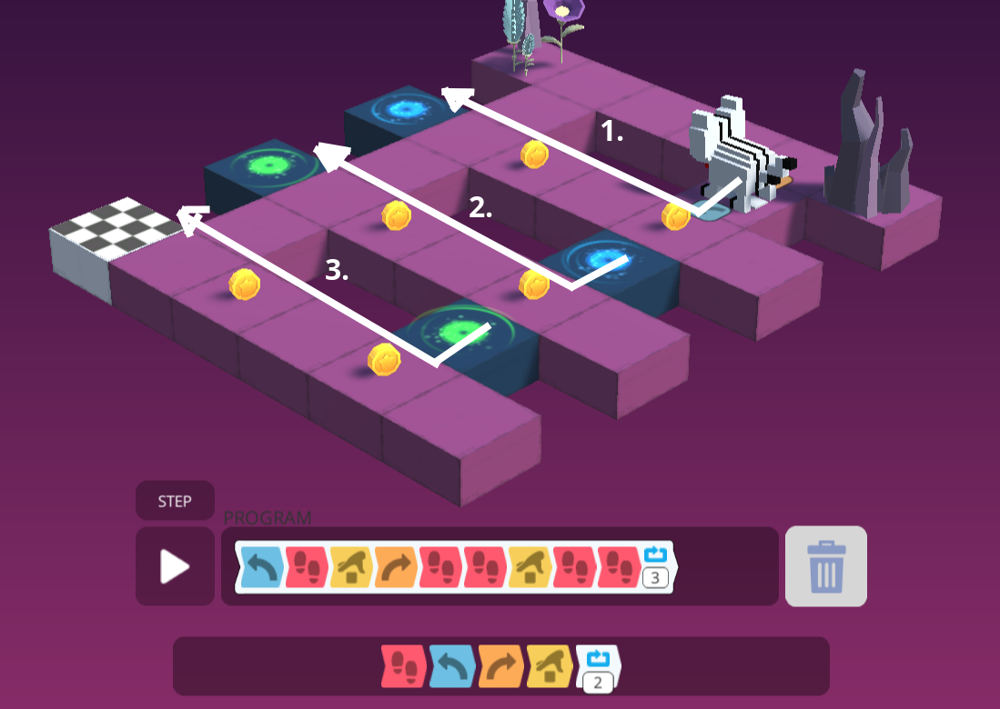
*Tässä kentässä jokaisen silmukan alussa on käännyttävä. Kenttä koostuu kolmesta L-kirjaimen muotoisesta osasta, jotka pitää kulkea.*

---

# Part 2: Funktiot eli aliohjelmat

---

> ### Funktiot
> Käy katsomassa seuraavien <u>Kidbot</u> ja <u>AlgoRun</u> pelien opettajan materiaalit, jos haluat yksityiskohtaisemman selityksen miten funktiot (eli aliohjelmat) toimivat.

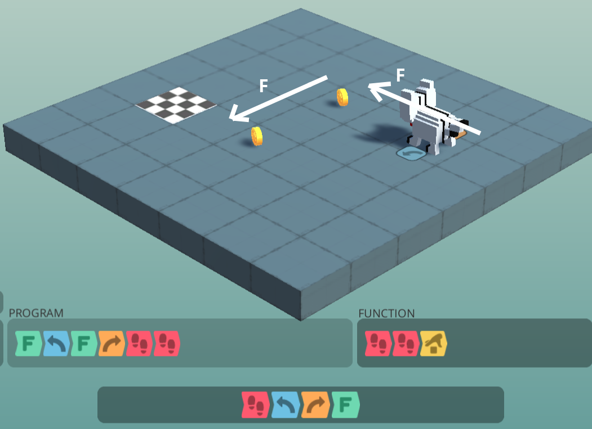
*Aina kun `F`-käsky suoritetaan, <u>Function</u>-laatikon sisällä olevat käskyt suoritetaan. Tässä esimerkissä `F`-käsky liikuttaa kissaa kaksi ruutua eteenpäin ja kerää kolikon.*

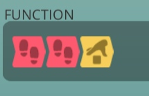
*Funktiolaatikon sisällä on käskyt <u>eteen, eteen, kolikko</u>*

*Nyt jokaisen `F`-käskyn kohdalla suoritetaan <u>Function</u>-laatikon käskyt eli <u>eteen, eteen, kolikko</u>*

## Part2: Lisää funktiotehtävien ratkaisuita

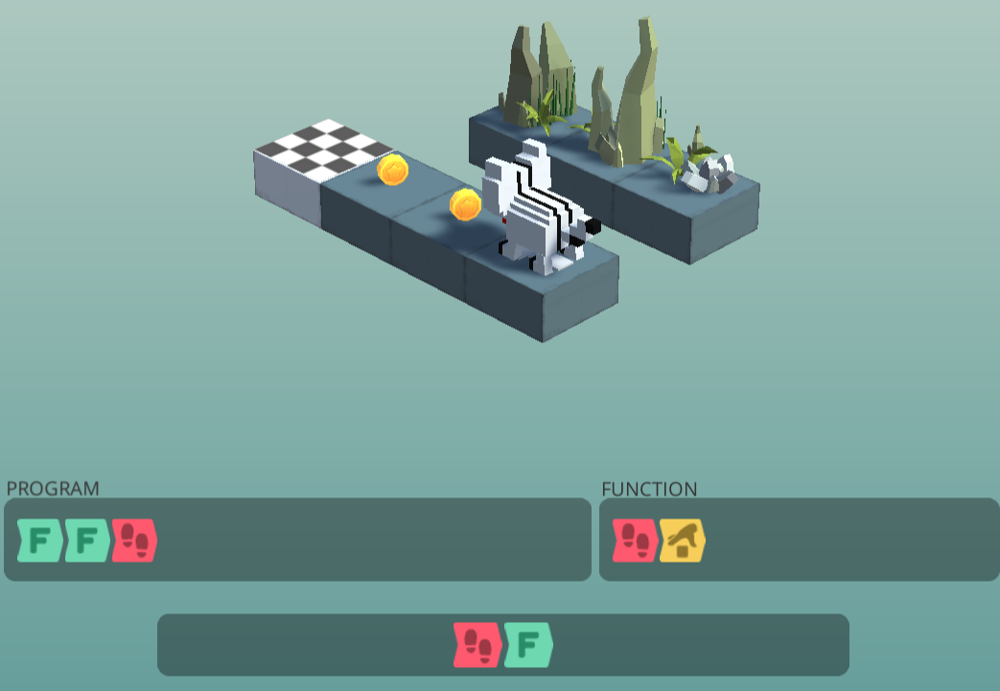

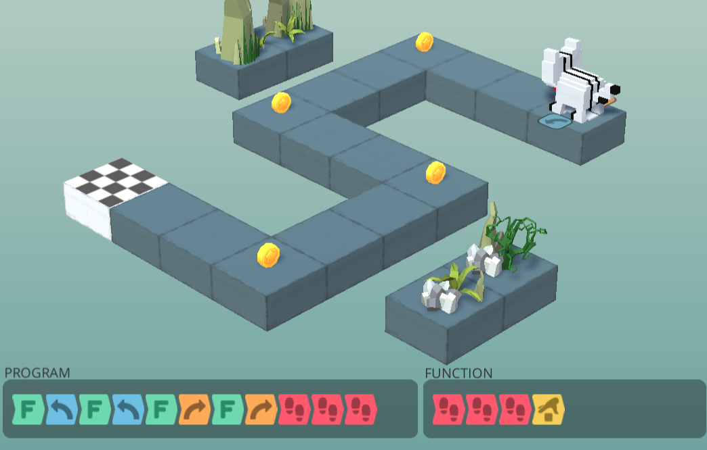

---
## Part 2: Monimutkainen silmukkatehtävä
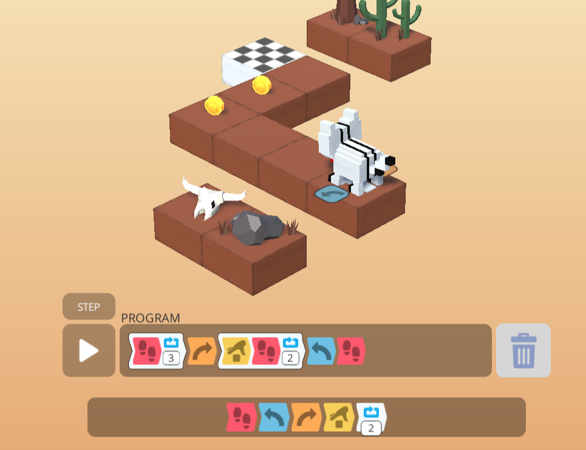
