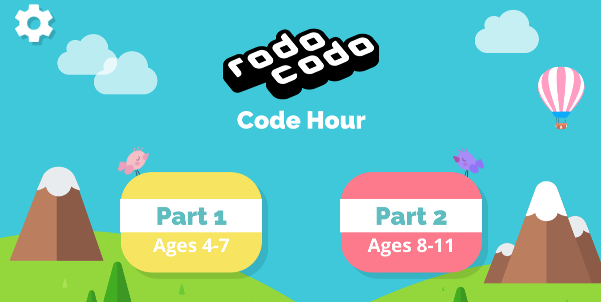

**Huom:** Käskypalikoiden raahaaminen ei toimi jostain syystä nettiversiossa kosketusnäytöllä. Käyttäkää nettiversiota ainoastaan hiiren kanssa tai ladatkaa mobiiliversio.

---

*Pelin alussa pelaajan on valittava kummasta vaikeustasosta haluaa aloittaa. Suosittelen aloittamaan **Part 1**:llä (jonka loppupään tehtävissä on kyllä haastetta isommillekin). Nopeimmat saavat sen luultavimmin tehtyä ja voivat siirtyä **Part 2**:n tehtäviin. Jos kaikki aloittavat Part 2:sta, riskinä on että harjoitukset ovat osalle liian vaikeita ja nopeimmat saavat tehtyä ne hetkessä ja heille pitää keksiä lisätehtäviä.*

**Huom 2:** Pelin Part 2 -osiossa harjoitellaan myös funktioiden käyttöä. Harjoittelemme funktioiden käyttöä enemmän tulevissa harjoituksissa, joten ei haittaa jos/kun suurin osa oppilaista ei niihin saakka todennäköisimmin ehdi. Kannattaa varautua kuitenkin selittämään funktioiden konsepti nopeimmille oppilaille, lukemalla tämän ohjeistuksen alaotsikko **Part 2: Funktiot**.

**Huom 3:** Suosittelen koittamaan peliä ennen esimerkkiratkaisuiden lukemista, sillä käytännössä oppiminen on parasta oppimista.

# Part 1:n esimerkkiratkaisuja
Robocodo on sivuston listaamista koodauspeleistä haastavimpia hahmottaa, joten olen listannut tänne esimerkkiratkaisut haastavimpiin tehtäviin:

*Tähän kenttään jää jumiin suurin osa oppilaista. Tärkeintä on tajuta, että ensin on kerättävä kaksi lähintä kolikkoa ja sitten palattava puun viereiselle teleportille, ei alanurkassa olevalle.*

***Buggy code** (buginen koodi) -osuudessa oppilaalle annetaan valmiiksi tehtyä, virheellistä koodia, joka hänen on korjattava järjestelemällä käskyt oikein. Tämä on jonkin verran haastava osuus sillä oppilas voi vahingossa raahata tarvittavan käskyn pois koodialueelta, jolloin se tuhoutuu ja <u>kenttä on aloitettava alusta (painamalla roskiskuvaketta koodin oikealla puolella). Oppilas ei välttämättä tajua tätä.</u>*

## Part 1: Silmukat

*Silmukkatehtävissä on tärkeää hahmottaa kentän toistuva osuus. Tässä kentässä pitää kolmesti kävellä ylös teleportilla (ja napata kolikko matkalla)*

*Tässä tehtävässä on kolme kahden kolikon rypästä eli koodin on toistettava kolmesti käyttäen `toista-x-kertaa`-silmukkaa.*

*Tässä tehtävässä on neljä identtistä saareketta, joten on käytettävä `toista` silmukkaa*

*Tässä kentässä jokaisen silmukan alussa on käännyttävä. Kenttä koostuu kolmesta L-kirjaimen muotoisesta osasta, jotka pitää kulkea.*

# Part 2: Funktiot

---

> ### Funktiot
> Kun halutaan toistaa käskysarja <u>useasti peräkkäin</u>, voidaan käyttää <u>toista-silmukkaa</u>.
>
> Jos halutaan toistaa tietty käskysarja <u>useissa eri vaiheissa ohjelman aikana</u>, ja toistojen välillä tehdä jotain muita juttuja, on tehtävä oma pikakomento eli <u>funktio</u>.

Tässä tehtävässä on toistettava kahdesti komennot: <u>eteen, eteen, kolikko.</u>

**Koodi:**  <u>eteen, eteen, kolikko</u>, vasemmalle <u>eteen, eteen, kolikko,</u> oikealle

Ensimmäisen toiston jälkeen on käännyttävä <u>vasemmalle</u>, mutta toisen toiston jälkeen on käännyttävä <u>oikealle</u>. Tällaista ei voi ratkaista silmukalla.

Koska emme halua toistaa samaa koodia useasti, on määriteltävä oma <u>pikakomento eli funktio</u>:

Ylläolevan funktionmäärittelyn käskyjä ei suoriteta automaattisesti, vaan ainoastaan jos käytämme `F` käskyä (eli funktiokutsua):

Nyt jokaisen `F`-käskyn kohdalla suoritetaan `Function` laatikon käskyt eli <u>eteen, eteen, kolikko</u>

## Part2: Lisää funktiotehtävien ratkaisuita

---
## Part 2: Monimutkainen silmukkatehtävä

