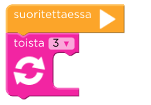

Tehtävät on mahdollista suorittaa käyttämättä toista-silmukoita. Täsmennä oppilaille että tehtävien tarkoitus on harjoitella `toista-x-kertaa` silmukan käyttöä, joten sitä on hyvä käyttää aina kun mahdollista. Selitä että vaikka nyt tehtävät voisikin ratkaista ilman sitä, koodatessa tulee tilanteita, jolloin joitain käskyjä pitää toistaa jopa satoja tuhansia kertoja. Silloin on pakko osata käyttää silmukoita.

---

**Huom:** Jos jonkun toista-silmukan sisään ei laita ainuttakaan käskyä, koodi on virheellistä eikä sitä suoriteta ollenkaan. Jos *"Suorita"* nappia painaessa ei tapahdu mitään, se johtuu todennäköisimmin tästä.

**Huom2:** Joskus Code.org ei päästä oppilasta seuraavaan tehtävään, vaikka hän olisi tehnyt tehtävän oikein. Tällöin kannattaa vain suorittaa koodi uudestaan.

**Huom3:** Jos käytössä ei ole kosketusnäytöllisiä tietokoneita, kannattaa huomioida että käskyjen raahaaminen voi olla haastavaa oppilaille, jotka eivät ole käyttäneet hiirtä aiemmin

